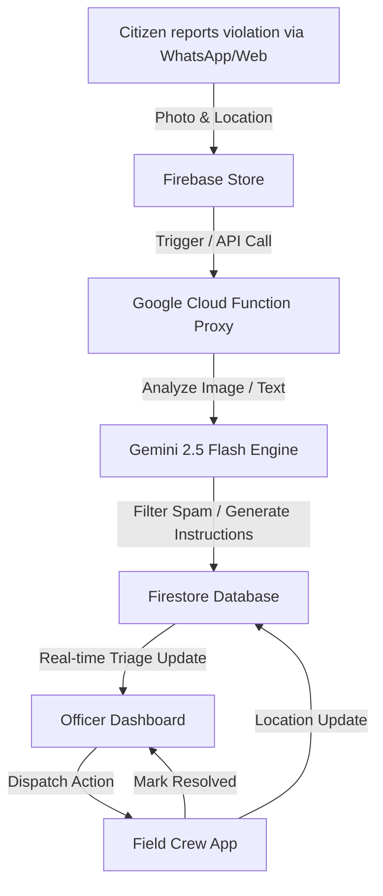

# 🌐 EMS (Environmental Monitoring System)
### *Air Quality Management & Field Operations Portal*

Submitted for the **"Build with AI: Code for Communities"** Hackathon.

Live Site: **[https://void-501114.web.app](https://void-501114.web.app)**

---

## 📌 Project Overview
Rapid urbanization and industrial activity lead to localized air quality violations (e.g., open waste burning, construction dust, industrial emission leaks) that often go unreported or suffer from delayed response times due to poor field coordination. 

**EMS** is an end-to-end municipal platform that bridges the gap between citizens, administrative officers, and field cleanup crews to report, analyze, and mitigate air quality hazards in real-time.

---

## 🚀 Key Features

### 1. **Citizen Portal (`citizen.html`, `report.html`, WhatsApp)**
*   **Simple Reporting**: Citizens report violations on the web or via WhatsApp by uploading an image and pinning their location.
*   **Intelligent Validation**: Phone number inputs automatically format to standard `+91` format for SMS/WhatsApp verification.

### 2. **AI-Powered Triaging & Moderation**
*   **Spam Filtering**: Automatically checks uploaded images against stock photos, screenshots, or unauthentic signatures to block spam reports.
*   **Forensic Report Generation**: A Gemini 2.5 Flash agent automatically estimates local AQI impact, identifies the pollutant category, drafts a 24-hour dispersion warning, and generates step-by-step mitigation instructions for the crew.

### 3. **Administrative Dashboard (`dashboard.html`, `gov.html`)**
*   **Triage List**: Multi-agent verified environmental violations requiring dispatch, structured cleanly and optimized for mobile screens.
*   **Interactive Spatial View**: Live Heatmaps of reported violations with a custom collapsible legend for decluttering.
*   **One-Click Dispatch**: Assigns verified incidents directly to available, location-matched Water-Mist Cannon units or Cleanup Crews.

### 4. **Field Crew Portal (`crew.html`, `crew_login.html`)**
*   **Live Tracking**: Active crews broadcast real-time GPS telemetry and availability status.
*   **Task Interface**: Interactive checklist showing crews exactly where to go, a map route, and recommended action directives.
*   **Resolution Sync**: Crews report back once the target area is resolved, instantly updating the Officer Dashboard.

---

## 🛠️ Technology Stack
*   **Frontend**: HTML5, Vanilla CSS3, Tailwind CSS (Responsive Design).
*   **Backend Databases**: Firebase Authentication, Cloud Firestore (multi-database instance named `"clean"`).
*   **Hosting**: Firebase Hosting (Security-hardened via `firebase.json` ignore rules).
*   **Serverless APIs**: Google Cloud Functions (Python 3.10 Runtime).
*   **AI Integration**: Gemini 2.5 Flash API (Environmental Forensics & Action Dispatching).
*   **Integrations**: Twilio WhatsApp API (Citizen Report Media Streams), Google Maps API (Spatial Layering), Leaflet (Offline Map Telemetry).

---

## 🔒 Security Hardening (Production-Ready)
*   **API Key Protection**: Twilio SID/Auth tokens and Gemini API keys are completely removed from the frontend client. They are proxied securely using serverless **Google Cloud Functions** with environmental variables.
*   **Firestore Rules**: Secured via [firestore.rules](file:///C:/Users/shada/Documents/cleanair-dashboard/firestore.rules) to prevent unauthorized read/writes on critical collections.
*   **Hosting Scopes**: Excluded serverless configurations (`gcf_file.txt`, `firestore.rules`) from public deployment targets.
*   **Authentication Cascading**: Consolidates auth checks, looking through `registered_citizens` first, then falling back to `government_officers` to eliminate role misidentification.

---

## 📂 Project Structure
*   [index.html](file:///C:/Users/shada/Documents/cleanair-dashboard/index.html) - Main Portal Landing Page (localized in English, Hindi, and Odia).
*   [citizen.html](file:///C:/Users/shada/Documents/cleanair-dashboard/citizen.html) - Citizen dashboard and status list.
*   [report.html](file:///C:/Users/shada/Documents/cleanair-dashboard/report.html) - Citizen incident report form.
*   [maps.html](file:///C:/Users/shada/Documents/cleanair-dashboard/maps.html) - Spatial Heatmap and Collapsible Map Legend.
*   [gov.html](file:///C:/Users/shada/Documents/cleanair-dashboard/gov.html) - Officer Portal entry.
*   [dashboard.html](file:///C:/Users/shada/Documents/cleanair-dashboard/dashboard.html) - Administrative Dashboard.
*   [crew_login.html](file:///C:/Users/shada/Documents/cleanair-dashboard/crew_login.html) - Field Crew Portal login.
*   [crew.html](file:///C:/Users/shada/Documents/cleanair-dashboard/crew.html) - Field Crew checklist and telemetry transmitter.
*   [gcf_file.txt](file:///C:/Users/shada/Documents/cleanair-dashboard/gcf_file.txt) - Python 3.10 serverless Google Cloud Function source code.
*   [firestore.rules](file:///C:/Users/shada/Documents/cleanair-dashboard/firestore.rules) - Firebase security rule specifications.
